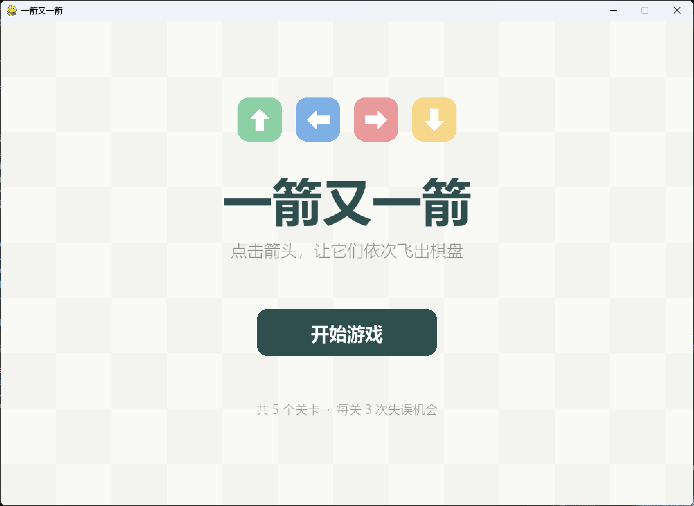
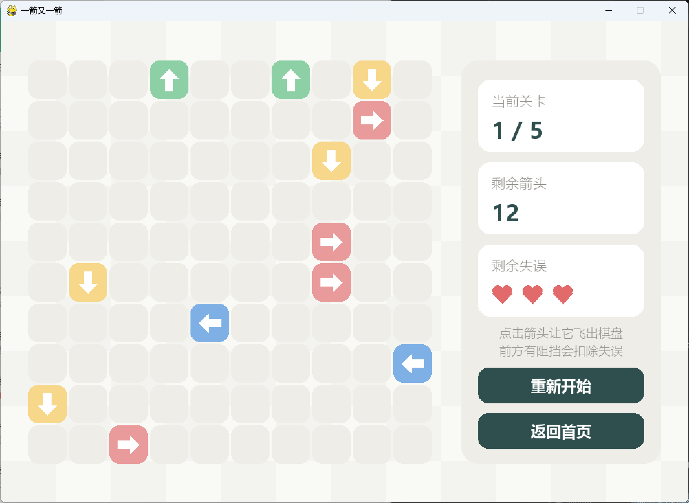
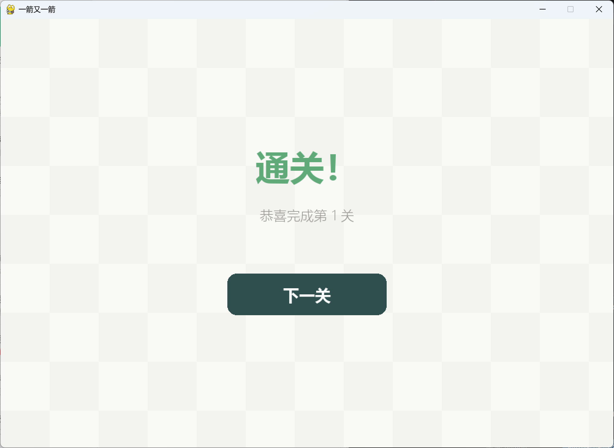
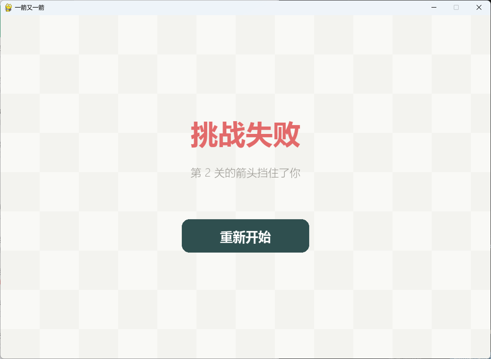
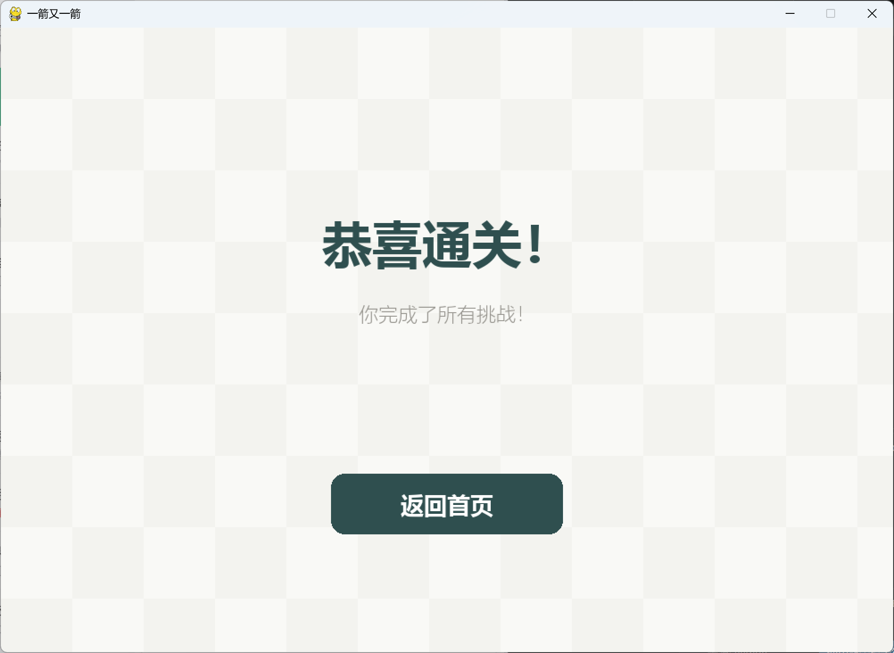

# 一箭又一箭 (Arrow Again)


使用 Python 和 Pygame 开发的一款极简风格点击解谜小游戏。基于作业要求实现基础版“一箭又一箭”核心玩法，并额外增加了粒子特效、音效与界面淡入过渡。

## 📸 游戏展示

| 开始界面 | 游戏界面 (关卡1) |
| :---: | :---: |
|  |  |

| 关卡通关 | 挑战失败 |
| :---: | :---: |
|  |  |

| 全部通关 (第5关后) |
| :---: |
|  |

## ✨ 核心功能

- **网格路径检测**：点击箭头，精确判断其前方（同一行/列）是否有其他箭头阻挡，支持隔空格检测。
- **状态机切换**：包含开始、游戏中、单关通关、全部通关、失败五种状态。
- **粒子特效**：箭头成功飞出时，原位会散发出同色系的小粒子。
- **音效系统**：包含箭头成功飞出的“嗖”声与碰撞阻挡的“咚”声。
- **淡入过渡**：界面切换时带有平滑的黑色遮罩淡入动画，视觉体验更佳。
- **多关卡设计**：内置 5 个经过验证的无死局关卡。

## 🛠️ 开发与运行环境

- **操作系统**: Windows / MacOS / Linux
- **Python 版本**: 3.9 及以上
- **核心依赖**: Pygame 2.6.1

## 🚀 安装与运行

1. 下载并解压本项目到本地。
2. 安装依赖库（任选其一）：
   ```bash
   # 直接安装
   pip install pygame
   
   # 或者使用 requirements.txt
   pip install -r requirements.txt
   ```

3. 运行游戏：
   ```bash
   python main.py
   ```

## 🎮 操作与规则

| 操作 | 效果 |
| :--- | :--- |
| **鼠标点击箭头** | 检测路径，无阻挡则飞出，有阻挡则扣血 |
| **R 键 / 重新开始** | 重置当前关卡，失误次数恢复为 3 次 |
| **Esc / 返回首页** | 退出当前游戏，回到开始界面 |

**基础规则**：每关有 3 次失误机会。点击前方有阻挡的箭头会扣除 1 次失误。清空棋盘所有箭头即可通关；失误次数耗尽则游戏失败。全部 5 关通关后有最终胜利界面。

## 📂 项目结构

```text
ArrowGame/
├── main.py                # 游戏主程序（包含核心逻辑、状态机、UI渲染）
├── AI使用记录.md           # AI 辅助开发的详细记录（需求对齐、Bug修复、UI美化）
├── 测试记录.md             # 游戏测试用例与结果记录
├── README.md              # 项目说明文档
├── requirements.txt       # 项目依赖
└── images/                # 游戏截图文件夹
    ├── start_screen.png
    ├── game_play.png
    ├── level_complete.png
    ├── game_over.png
    └── game_win.png


## 🎓 开发心得与AI辅助

本项目使用 ChatGPT 和 DeepSeek 辅助开发，历经“需求对齐重构”、“死局Bug修复”、“UI全面美化”与“视听效果升级”四个阶段。详细过程请查阅 `AI使用记录.md`。在此过程中，AI 极大地提高了代码编写效率，但人工的逻辑审查与 Bug 修复依然是项目成功的关键。

---
*本项目为福州大学 2026 秋软件工程个人作业（第二次）。*